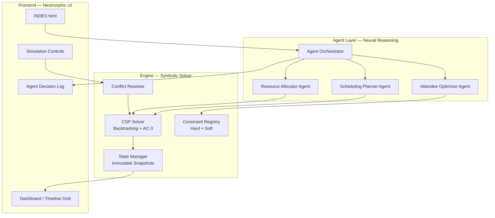
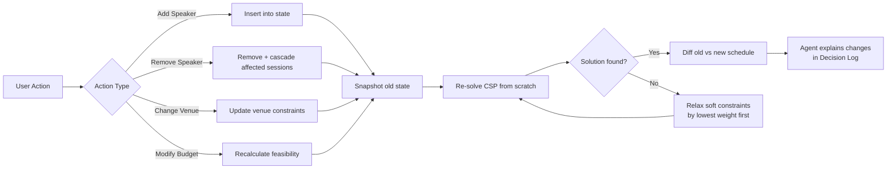

# AI Agent for Dynamic Event Planning Under Constraints

An agentic planning system that dynamically organizes event schedules while handling conflicts and changing constraints, built on a **Hybrid Neuro-Symbolic Architecture**.

## Architecture Overview



### Why Hybrid Neuro-Symbolic?

| Concern | Symbolic Engine (CSP) | Neural Layer (LLM/Agents) |
|---|---|---|
| **Room double-booking** | ✅ Hard constraint — guaranteed | — |
| **Speaker time conflicts** | ✅ Hard constraint — guaranteed | — |
| **Budget arithmetic** | ✅ Exact math — guaranteed | — |
| **Venue capacity** | ✅ Hard constraint — guaranteed | — |
| **"Which talk fits morning energy?"** | — | ✅ Reasoning on soft preferences |
| **"Explain why Session B moved"** | — | ✅ Natural-language justification |
| **Re-optimization strategy** | ✅ Re-solve from new state | ✅ Prioritize which constraints to relax |

The symbolic CSP solver **guarantees** no hard constraint violations. The agent layer handles soft optimization, prioritization, and human-readable explanations.

---

## Data Model

All data is defined as plain JavaScript objects stored in a central `EventState`:

```javascript
// Core entities
Speaker    = { id, name, topic, duration (mins), preferredSlots[], fee }
Venue      = { id, name, capacity, equipment[], costPerHour, availableSlots[] }
TimeSlot   = { id, label, start (ISO), end (ISO), day }
Attendee   = { id, name, interests[], preferredSpeakers[], vipLevel }
Budget     = { total, allocated, remaining, breakdown{} }

// Scheduling output
Session    = { id, speakerId, venueId, timeSlotId, attendeeCount }
Schedule   = { sessions[], conflicts[], score, timestamp }
```

---

## Constraint System

### Hard Constraints (must never be violated)
| ID | Constraint | Logic |
|---|---|---|
| H1 | **No room double-booking** | ∀ sessions s1,s2: if s1.venueId == s2.venueId → s1.timeSlotId ≠ s2.timeSlotId |
| H2 | **No speaker double-booking** | ∀ sessions s1,s2: if s1.speakerId == s2.speakerId → s1.timeSlotId ≠ s2.timeSlotId |
| H3 | **Venue capacity** | ∀ sessions s: s.attendeeCount ≤ venue(s.venueId).capacity |
| H4 | **Budget cap** | Σ(session costs) ≤ budget.total |
| H5 | **Speaker availability** | ∀ sessions s: s.timeSlotId ∈ speaker(s.speakerId).preferredSlots |
| H6 | **Venue availability** | ∀ sessions s: s.timeSlotId ∈ venue(s.venueId).availableSlots |

### Soft Constraints (optimized, not guaranteed)
| ID | Constraint | Weight |
|---|---|---|
| S1 | **Attendee interest match** — assign popular speakers to larger venues | 3 |
| S2 | **Topic diversity per slot** — avoid two AI talks at the same time | 2 |
| S3 | **VIP preference satisfaction** — VIPs get their preferred speakers | 4 |
| S4 | **Budget efficiency** — minimize cost while maintaining quality | 2 |
| S5 | **Time preference** — honor speaker preferred time slots | 1 |

---

## Conflict Resolution Strategy

> The reason for a change is irrelevant; the agent handles the "Add" or "Remove" action and re-optimizes the entire plan.



### Re-optimization Algorithm
1. **Snapshot** the current state (immutable)
2. **Apply** the mutation (add/remove/modify)
3. **Re-solve** the entire CSP with all hard constraints
4. **If infeasible**: relax soft constraints in ascending weight order until a solution is found
5. **Diff** old schedule vs new schedule
6. **Log** every change with a human-readable reason via the Agent layer

---

## CSP Solver Design

A **backtracking solver with AC-3 constraint propagation**, implemented in pure JavaScript:

```
function solve(variables, domains, constraints):
    // AC-3 pre-processing — prune domains
    ac3(domains, constraints)
    
    // Backtracking with MRV heuristic
    return backtrack({}, variables, domains, constraints)

function backtrack(assignment, variables, domains, constraints):
    if all variables assigned: return assignment
    
    var = selectUnassigned(variables, domains)  // MRV: pick smallest domain
    for value in orderDomainValues(var, domains):
        if isConsistent(var, value, assignment, constraints):
            assignment[var] = value
            // Forward checking
            savedDomains = propagate(var, value, domains, constraints)
            result = backtrack(assignment, variables, domains, constraints)
            if result: return result
            restore(savedDomains)
            delete assignment[var]
    return null  // backtrack
```

**Key optimizations:**
- **MRV (Minimum Remaining Values)**: Always assign the variable with the fewest remaining legal values first — this fails fast and prunes the search tree
- **AC-3 arc consistency**: Pre-prune domains before search begins
- **Forward checking**: After each assignment, immediately prune neighboring domains

---

## Agent System Design

Three specialized agents, coordinated by an orchestrator:

### 1. Scheduling Planner Agent
- **Input**: Speakers, venues, time slots, hard constraints
- **Action**: Invokes the CSP solver to produce a valid schedule
- **Output**: A feasible `Schedule` object

### 2. Resource Allocator Agent
- **Input**: Budget, venue costs, speaker fees
- **Action**: Validates budget feasibility, suggests cost optimizations
- **Output**: Budget allocation breakdown, warnings if over budget

### 3. Attendee Experience Optimizer Agent
- **Input**: Attendee preferences, current schedule
- **Action**: Scores the schedule on soft constraints, suggests swaps
- **Output**: Satisfaction score, improvement suggestions

### Orchestrator Flow
```
1. User provides/modifies inputs
2. Orchestrator calls Resource Allocator → validates budget
3. Orchestrator calls Scheduling Planner → generates schedule via CSP
4. Orchestrator calls Attendee Optimizer → scores + suggests improvements
5. If suggestions improve score AND satisfy hard constraints → apply
6. Log all decisions to the Agent Decision Log
```

> [!IMPORTANT]
> The agents operate as **deterministic rule-based systems** with structured logging. There is no actual LLM API call required — the "neural reasoning" is simulated through weighted scoring functions and templated natural-language explanations. This makes the system fully self-contained, runnable offline, and free of API dependencies. The architecture is designed so that a real LLM can be plugged in later for richer reasoning.

---

## Proposed Changes

### Single-File Application

Since the user explicitly requires building inside [INDEX.html](file:///c:/Users/aroky/OneDrive/Desktop/ai_dynamic_event_planning/INDEX.html), the entire application will be a single self-contained HTML file with embedded CSS and JavaScript.

#### [MODIFY] [INDEX.html](file:///c:/Users/aroky/OneDrive/Desktop/ai_dynamic_event_planning/INDEX.html)

The existing neumorphic shell will be repurposed and expanded:

**CSS Changes:**
- Rebrand from "Purna Opticians" to "EventFlow AI"
- Add dark-mode color tokens for the event planning domain
- Add timeline grid styles, card components, tag/chip styles
- Add modal and toast notification styles
- Add micro-animations for schedule changes and agent activity
- Add responsive glassmorphism panels

**HTML Structure (within the existing shell):**
- **Left Nav Rail** — repurpose icons for: Dashboard, Speakers, Venues, Budget, Attendees, Schedule, Agent Log, Analytics
- **Sidebar** — context-sensitive panel showing entity details or simulation controls
- **Content Area** — main view that switches between:
  - **Dashboard**: Schedule grid (days × time slots), color-coded by venue
  - **Speakers**: Card list with add/remove/edit
  - **Venues**: Card list with capacity and equipment
  - **Budget**: Donut chart + allocation table
  - **Simulation**: "Last-minute change" controls (add/remove speaker, change venue, modify budget)
  - **Agent Log**: Chronological feed of agent decisions with reasoning

**JavaScript (~1500 lines):**
1. **Data Layer** (`EventState` class) — immutable state snapshots, diff engine
2. **CSP Solver** (`CSPSolver` class) — backtracking + AC-3 + MRV
3. **Constraint Registry** (`ConstraintRegistry`) — hard/soft constraint definitions
4. **Conflict Resolver** (`ConflictResolver`) — handles mutations, triggers re-solve
5. **Agent System** (`AgentOrchestrator`, `SchedulingPlanner`, `ResourceAllocator`, `AttendeeOptimizer`)
6. **UI Controller** (`UIController`) — view management, rendering, event binding
7. **Sample Data** — pre-loaded conference scenario with 8 speakers, 4 venues, 12 time slots, 20 attendees

---

## Verification Plan

### Automated Tests (Browser-Based)
Since this is a single HTML file, verification will be done through the browser:

1. **Open [INDEX.html](file:///c:/Users/aroky/OneDrive/Desktop/ai_dynamic_event_planning/INDEX.html)** in the browser using the browser subagent
2. **Verify initial load**: Dashboard renders with a valid auto-generated schedule
3. **Test constraint satisfaction**:
   - Inspect the generated schedule — no room or speaker double-bookings
   - Budget total on dashboard ≤ configured budget limit
4. **Test conflict resolution — Remove Speaker**:
   - Click on a speaker → click "Remove"
   - Verify the schedule re-optimizes and the Agent Log shows the reasoning
5. **Test conflict resolution — Add Speaker**:
   - Click "Add Speaker" → fill in details
   - Verify the speaker is scheduled without conflicts
6. **Test simulation controls**:
   - Use "Simulate Change" panel to trigger a venue capacity reduction
   - Verify affected sessions are re-assigned to alternative venues
7. **Verify Agent Decision Log** shows timestamped, human-readable entries

### Manual Verification
- The user can visually verify the schedule grid, interact with simulation controls, and confirm the agents explain their decisions in natural language.
